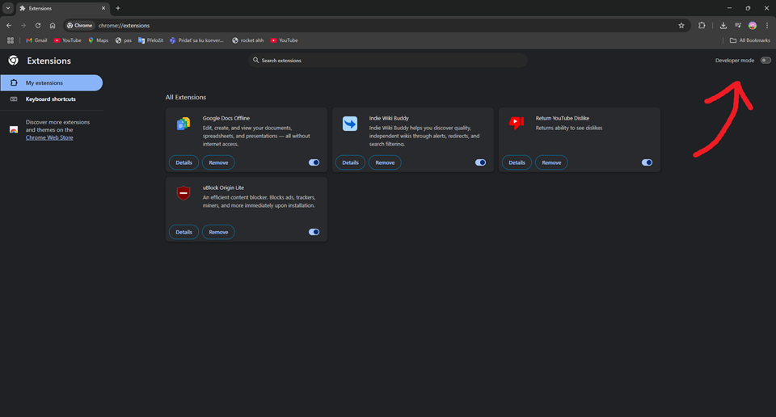
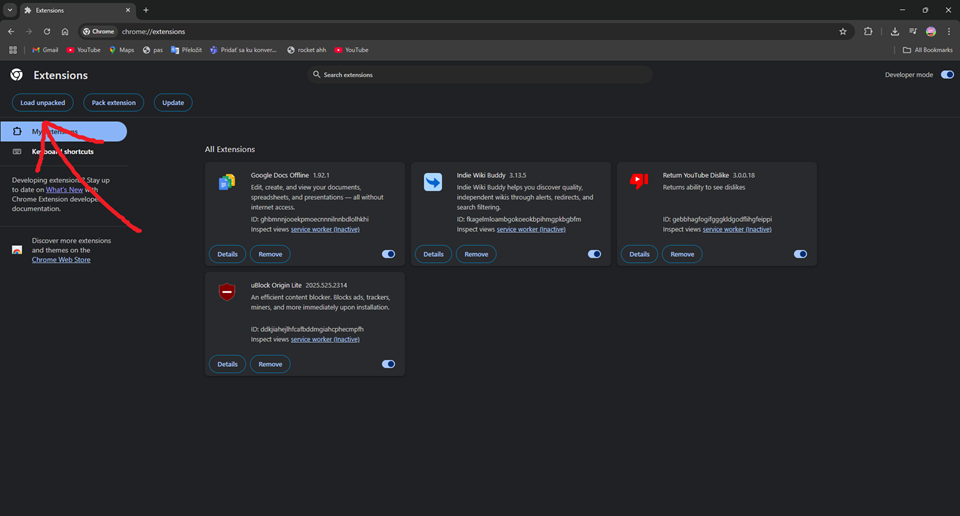
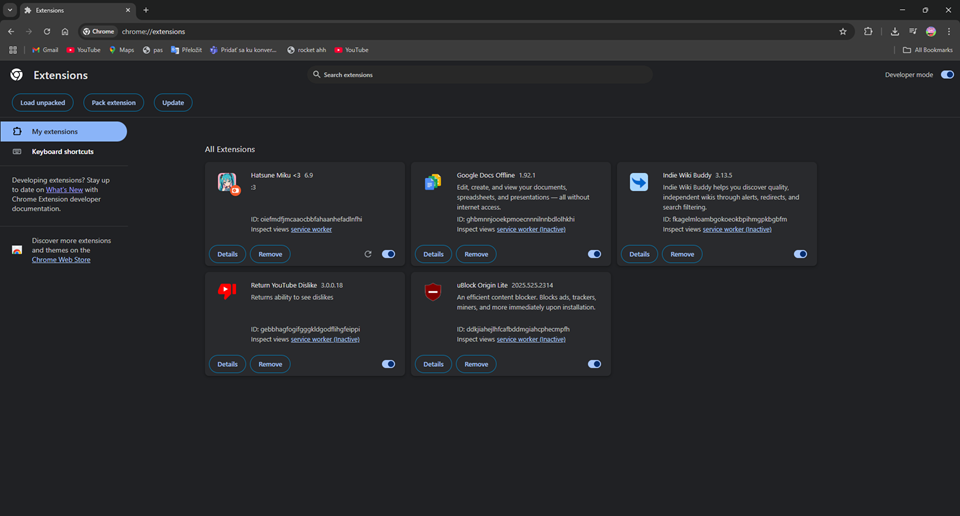
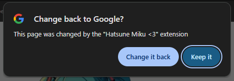

# 🌟 Miku-Tabs

Tired of plain old new tabs?  
**Miku-Tabs** is a Chrome extension that brings a dose of cuteness to your browser with the one and only **Hatsune Miku!** 💙🎶

Say goodbye to boring tabs and hello to Miku magic every time you open your browser. ✨

---

## 🛠️ How to Install Miku-Tabs via GitHub

Since **Miku-Tabs** isn’t available on the Chrome Web Store, here’s how to install it manually:

### ✅ Step 1: Clone the Repository

Open your terminal and run:

```bash
git clone https://github.com/SirPigari/miku.git
```

This will create a folder called `miku` with the extension files on your computer.

---

### ✅ Step 2: Open Chrome Extensions Settings

1. Open **Google Chrome**.
2. In the address bar, type: [`chrome://extensions/`](chrome://extensions) and press **Enter**.
3. Enable **Developer mode** using the toggle in the top-right corner.



---

### ✅ Step 3: Load the Extension

1. Click the **Load unpacked** button.  


2. In the dialog, navigate to the `miku` folder you cloned earlier and select it.

3. After selecting the folder, the extension will appear in your list like this:  


---

### ✅ Step 4: Approve the New Tab Override

When you open a new tab for the first time, you’ll see this prompt:



Click **Keep it** to confirm.

---

🎉 **That’s it!**  
Enjoy browsing with a touch of Miku’s charm! 💖
